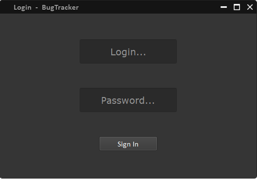
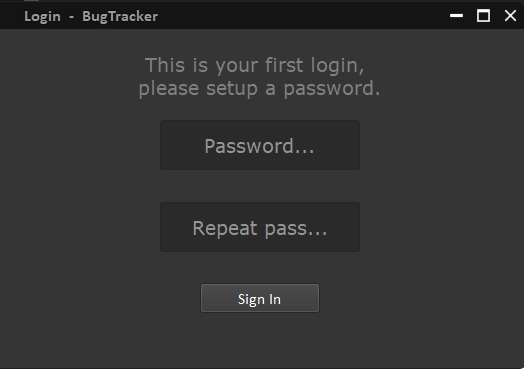
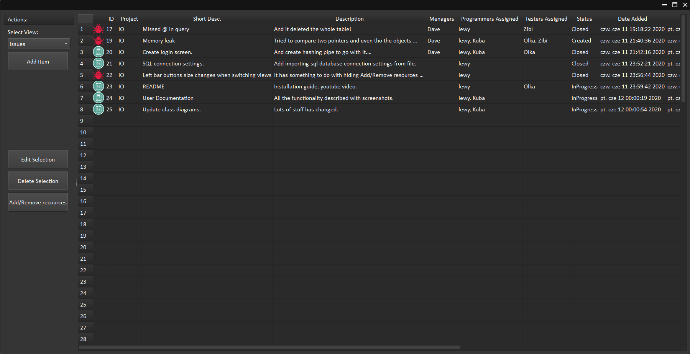

# IO_BugTracker
 Projekt na zajęcia z Inżynierii Oprogramowania ZUT
 
 W repozytorium znajdują się wszystkie pliki potrzebne do kompilacji kodu wraz z dokumentacją.
 
 W folderze [release](/release) znajduje się gotowa aplikacja na wypadek gdyby kompilacja sprawiła trudności.  

 Na końcu tego dokumentu znajduje się również krótki filmik na youtubie przedstawiający funkcjonalność aplikacji,  
 na wypadek gdyby rekonstrukcja lub konfiguracja bazy danych sprawiły trudności. 

## Kompilacja.
 Do kompilacji kodu potrzebne są:
 - Biblioteka Qt z komponentami core, gui, sql
 - qmake
 
 Najprostszą metodą jest instalacjia biblioteki Qt wraz z IDE Qt Creator ze strony: https://www.qt.io/download-qt-installer  
 Następnie w Qt Creator otwieramy plik [IO_BugTracker\.pro](IO_BugTracker.pro) zawarty w repozytorium i ustawiamy konfigurację kompilacji.
 Skrót Ctrl+R powinien zbudować i uruchomić aplikację.
 
## Baza danych.
 W repozytorium zawarty jest plik IO_Bugtracker.bak jest to backup bazy danych SQL Server.  
 Należy zainstalować SQL Server Express lub Developer ze strony: https://www.microsoft.com/en-us/sql-server/sql-server-downloads  
 Warto też zainstalować Microsoft SQL Server Management Studio lub inny menadżer do SQL Server,  
 ułatwi to przywrócenie bazy danych z pliku.
 Dokładne instrukcje do importowania backupu można znaleźć na stronie: https://sqlbackupandftp.com/blog/restore-database-backup  
 
 Ważne jest aby ustawić na serwerze bazy danych i na samej bazie danych użytkownika z odpowiednimi uprawnieniami i hasło.  
 
 W folderze z którego będziemy uruchamiać **skompilowaną aplikację** należy umieścić plik [SqlConnectionSettings\.txt](SqlConnectionSettings.txt) .  
 W pliku zawarte są ustawienia połączenia z bazą danych (login, hasło, adres ect.) **które będą wymagały modyfikacji**.  
 W konfiguracji serwera należy ustawić **Server authentication**: SQL Server and Windows Authentication mode.  
 W ustawieniach sieci SQL server należy włączyć protokół TCP/IP http://www.manifold.net/doc/mfd9/enable_tcp_ip_for_sql_server.htm
 Będzie tam również pokazany port dla połączenia, domyślnie 1433.
 
## Dostęp do aplikacji.
 Do dostępu jest skonfigurowane konto o loginie: **DrDariusz**, kapitalizacja nie ma znaczenia.  
 Przy pierwszym logowaniu użytkownik zostanie poproszony o konfigurację hasła.  
 Po zalogowaniu istnieje możliwość tworzenia kolejnych kont i podobnie ustawienie hasła jest możliwe przy pierwszej próbie zalogowania.
 
## Troubleshooting.
 Jeżeli któryś z tych kroków jest niejasny lub sprawia trudności to proszę o kontakt ze mną na aplikacji Teams.
 
## Screenshoty oraz krótka prezentacja funkcjonalności.

### Ekran logowania:

### Ekran zmiany hasła:

### Widok główny:

## Film opisujący funkcjonalność:

 
 
